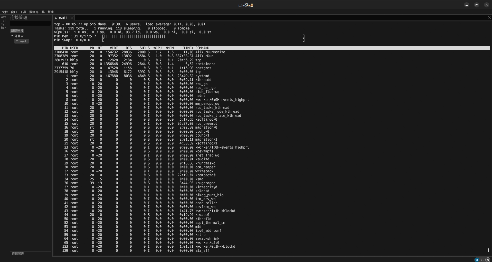

LSYShell
=======

LSYShell is a stateful, Shell and code edit and db edit supporting:

- [x] Cross-platform. Including platforms such as Wendos, Linux, Androyd, etc.
- [ ]  Terminal shell. Based on cross-platform, there is no need for one software for Windows, Linux is another software. For example, MobaXterm, which is very easy to use under windows, cannot be used under linux. And such as, FinalShell and Terminus, and occupies most of the memory resources.
- [ ] Code editing, including languages Go, vue, Python, Rust, etc.
- [ ] Database linking and editing. Based on cross-platform, there is no need for one software for Windows, Linux is another software.

